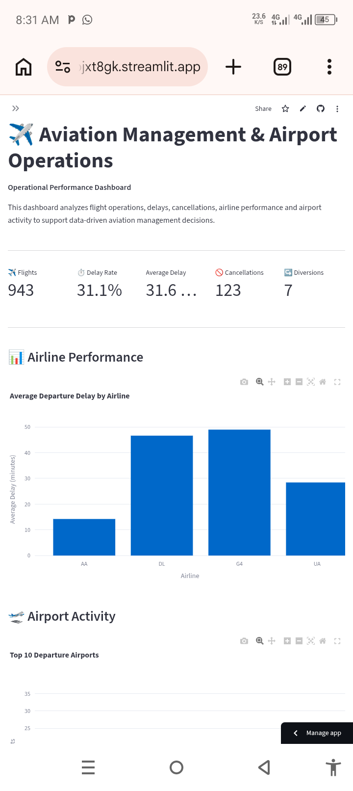

# ✈️ Aviation Management & Airport Operations Dashboard

An interactive aviation analytics dashboard designed to help aviation managers understand flight operations, identify operational risks, and make data-informed management decisions.

## 🎯 Project Overview

This project analyzes airline and airport operational data to transform raw flight information into actionable insights.

The dashboard focuses on key aviation management questions such as:

- How many flights are being operated?
- Which airlines experience higher departure delays?
- What are the major causes of delays?
- Which airports have the highest activity?
- What are the busiest flight routes?
- How many flights are delayed, cancelled, or diverted?
- What operational risks require management attention?

## 📊 Dashboard Features

### ✈️ Flight Operations Performance
- Total flights
- Overall delay rate
- Average departure delay
- Cancellations
- Diversions

### 📈 Airline Performance
- Average departure delay by airline
- Comparison of airline operational performance

### 🛫 Airport Activity
- Top departure airports
- Flight activity analysis

### ⏱️ Delay Cause Analysis
The dashboard analyzes major delay contributors, including:

- Carrier delays
- Late aircraft
- Air traffic / NAS delays
- Security delays

### 🗺️ Busiest Flight Routes
Identifies the routes with the highest number of operations.

### 🚨 Operational Risk Indicators
Highlights:

- Flights delayed 15+ minutes
- Operational disruptions
- Overall operational risk

### 🎯 Aviation Manager's Decision Center
The dashboard automatically evaluates operational performance and provides management-oriented recommendations based on the selected flight data.

## 🧠 Management Approach

Rather than presenting statistics alone, this project connects aviation data to management decisions.

For example:

**Operational problem → Data analysis → Risk assessment → Management recommendation**

This approach demonstrates how aviation managers can use operational data to identify recurring problems and prioritize areas requiring attention.

## 🛠️ Technologies Used

- Python
- Streamlit
- Pandas
- Plotly
- GitHub

## 📂 Project Structure

```text
aviation-management-dashboard/
│
├── dashboard/
│   └── app.py
│
└── README.md
